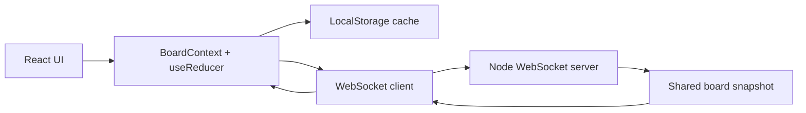

# Collaborative Task Board

A multi-user real-time task board built with React, Context + useReducer, and a small WebSocket backend for instant cross-window synchronization.

## Features

- Full CRUD for tasks with title, description, assignee, due date, priority, tags, and subtasks
- Drag-and-drop task movement across backlog, in-progress, and done columns
- Live collaboration across browser windows using WebSocket sync
- Optimistic local updates with localStorage caching and reconnect sync
- Presence list showing other connected collaborators
- Conflict warning banner for remote updates
- Undo/redo support with a 50-step history window
- Filter and sort panel with URL-synced state

## Architecture



## Run locally

```bash
npm install
npm run dev:all
```

Then open http://localhost:5173 in two browser windows to see live collaboration in action.

## Verification

```bash
npm test
npm run build
```

## Demo recording

Open the app in two windows and create, edit, or reorder tasks in one window. The same board should update instantly in the second window.
